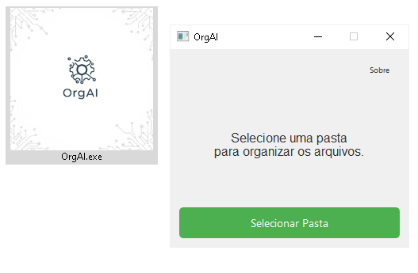

<!-- filepath: /c:/Users/Pichau/Desktop/organize.AI/README.md -->
# OrgAI



## Descrição

OrgAI é um aplicativo que organiza os arquivos de uma pasta com base na extensão dos mesmos.

## Requisitos

- Python 3.11 ou superior  
- As dependências estão listadas no arquivo [requirements.txt](./requirements.txt)

## Instalação

1. Clone o repositório ou baixe os arquivos.
2. (Opcional) Crie e ative um ambiente virtual:
   ```bash
   # Windows 10/11
   python -m venv venv
   venv\Scripts\activate
   pip install -r requirements.txt
   python main.py
   pyinstaller --onefile --windowed --icon=Gemini_Generated_Image_qu6qzqu6qzqu6qzq.ico --add-data "Gemini_Generated_Image_qu6qzqu6qzqu6qzq.ico;." OrgAI.py
   ```